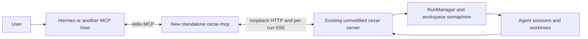

# Standalone cezar-mcp for external task supervision

## 📝 TLDR

Build **cezar-mcp as an independent product** through which an external agent such as Hermes supervises tasks in an already-running cezar cockpit. Its proposed `cezar-mcp` command exposes task creation, inspection, conversation, continuation, cancellation and bounded event waiting over stdio MCP, using only cezar's HTTP/SSE API. No change to cezar's source, package dependencies, state files or installation is required; a thin composition layer keeps a later move into cezar possible without changing the MCP tools.

This is a design document. No CLI or npm package exists in this repository yet.

## Provenance and change of direction

This replaces the product-placement assumptions of [the earlier design in closed cezar PR #1263](https://github.com/open-mercato/cezar/pull/1263), specifically its [specification at commit 6529194d](https://github.com/vloneskorpion/cezar/blob/6529194d/.ai/specs/2026-10-04-cezar-mcp.md). The user explicitly chose a separate product in `vloneskorpion/cezar-mcp`, with a possible future move into cezar. That earlier PR is historical research, not an implementation dependency or a request to reopen it. All work and PRs for this specification target the independent repository.

Keep the earlier task catalog, project scoping, delivery semantics, bounded waits and no-retry rule. Replace its in-monorepo modules, `cezar mcp` command, contract extraction, `CEZ_MCP` gate and cezar package modifications with independent modules, a standalone command and a tested external compatibility boundary.

## Resolved assumptions (autonomous defaults)

The user has decided independent repository/product ownership, API-based communication, reuse of the earlier design, and migration-friendly module boundaries. The earlier local stdio, existing-cockpit, no publishing/merging, exact message text and no automatic mutation retry decisions remain in effect.

| # | Question | Applied default | Why | Confirm? |
|---|---|---|---|---|
| Q1 | Ship the adapter, permanent supervisor scheduling and future upstream migration together? | Ship the adapter and bounded supervision only; document a future migration recipe without implementing it. | Scheduling and product migration are independently deployable work; the requested loop works while the host calls the tools. | ok |
| Q2 | Retain the earlier CEZ_MCP gate? | Launching the installed `cezar-mcp` command is the explicit opt-in; no CEZ_MCP setting or change in cezar. Keep optional `--read-only`. | No new listener or background process is added to cezar; the external host owns the adapter process. | ok |
| Q3 | Obtain contracts from private cezar workspaces? | Maintain a small local Zod boundary for consumed HTTP/SSE fields, checked by fixtures and live conformance tests. | Private workspace packages are not a supported external distribution interface. | ok |
| Q4 | Require public npm publication before use? | Build and install from this repository or a local tarball first. Public npm publication is a separate release action. | Avoid depending on namespace availability or release credentials to use the product. | ok |
| Q5 | Promise compatibility with which cezar versions? | Target inspected revision 1f40016d87d2b7ace23eedbdeae42bdf60c52684 first; record a release as verified only after the external tests run against its exact artifact. | The inspected package says 0.14.0, which is not proof that every build with that label behaves identically. | ok |

No default requires human confirmation to review this design. Naming an npm package is not permission to publish it; the initial usable installation needs no registry publication.

## 📝 Problem Statement

The requested flow is **user → external AI supervisor (for example Hermes) → cezar → implementation workers**. Today an external agent must know cezar's HTTP routes, understand session states, and assemble its own event reader. A tool that only starts a worker cannot supervise it: it must also observe questions, distinguish queued messages from delivered messages, and return to tasks after they settle.

Evidence from the separate cezar checkout at [revision `1f40016d87d2b7ace23eedbdeae42bdf60c52684`](https://github.com/open-mercato/cezar/tree/1f40016d87d2b7ace23eedbdeae42bdf60c52684); all `packages/...` paths in this evidence list belong to cezar, not this repository:

- `packages/cezar/src/server/server.ts` exposes project discovery, run creation, paged history, messages, continuation, cancellation, diffs and SSE under `/api/v1`. These are the canonical control paths.
- `packages/contract/src/{runs,events,dispatch,projects,health,workflows}.ts` define reusable wire schemas. `continueSchema` is still handler-local in `server.ts`. The independent adapter validates the subset it sends locally; it does not move that schema or change the server.
- `packages/cezar/src/workflows/run.ts`, `RunManager.dispatch`, requires an existing nonterminal parent run. It creates autonomous children and forks their worktrees from the parent's branch. An external MCP client is not itself a run.
- `packages/cezar/src/dispatch/task-cli.ts` already demonstrates a thin HTTP client with `CEZ_API_URL` and `CEZ_PROJECT_ID`; its `create` command dispatches a child of `CEZ_TASK_ID`, rather than creating an independent root task.
- `/messages` can return `delivered`, `queued` or `deferred`; a closed session returns 409. `/continue` is a distinct explicit operation.
- Per-run SSE supports `afterSeq`, `Last-Event-ID` and history cursors. Workspace SSE is a live feed, not a durable replay log; it must not become a fictional lossless global event cursor.
- [PR #1262](https://github.com/open-mercato/cezar/pull/1262) proposes an owner-bound `report_task_result` MCP tool inside workers. It was open during the original research and is complementary: worker reports are data for supervision, not permission to create or control runs. This spec has no dependency on it landing.

## 📝 Proposed Solution

The external host starts one `cezar-mcp` process, versioned and installed independently of cezar. It speaks MCP over stdin/stdout and makes validated loopback HTTP requests to a selected running cockpit. Every task operation requires `projectId`; every existing-task operation also requires `runId`. The adapter never imports `RunManager`, opens `RunStore`, writes run files or starts workers directly. It has no runtime dependency on a cezar checkout and does not start the cezar server.

Two supported orchestration patterns use the same tools:

1. **External supervisor:** Hermes creates ordinary root tasks, retains their returned identities and coordinates them through messages and event waits. These tasks retain ordinary scheduling and independent worktree bases; no synthetic parent or common tree budget is implied.
2. **Existing cezar dispatch tree:** Hermes addresses a real nonterminal parent with `dispatch_task`, or creates a normal commander run with a dispatch intent. Existing child caps, budgets, branch relationships and report delivery remain the engine's responsibility. A real commander uses its configured runner and has its own cost; it is not an empty container for Hermes.

The first pattern satisfies the main request without a new engine lifecycle. The second exposes capabilities cezar already has. Cezar's review state remains distinct from proof that an implementation is correct or merged.

### Research and alternatives

Research checked on 2026-10-04 against primary sources:

| Source | Adopt | Deliberately leave out |
|---|---|---|
| [Hermes MCP documentation](https://hermes-agent.nousresearch.com/docs/user-guide/features/mcp/) | A named stdio server in `mcp_servers`, discoverable tools and host-side tool filtering. Configure tool timeout above the bounded wait duration. | A Hermes-specific plugin, server-side sampling, or the assumption that an MCP notification starts a new supervisor turn. |
| [Official MCP TypeScript SDK](https://ts.sdk.modelcontextprotocol.io/v2/get-started/first-server) | The maintained SDK, Zod tool schemas and protocol error handling; Node 20 and ESM are the proposed standalone stack and match cezar. | Hand-written JSON-RPC or a new web framework. Pin a released SDK version compatible with the repository and verify the actual Hermes handshake. |
| [MCP stdio transport](https://github.com/modelcontextprotocol/modelcontextprotocol/blob/main/docs/specification/draft/basic/transports/stdio.mdx) | Protocol-only stdout, diagnostics on stderr, host-owned process lifecycle. | A listening MCP port in the initial release. |
| [GitHub MCP server configuration](https://github.com/github/github-mcp-server/blob/main/docs/server-configuration.md) | A finite tool catalog and an optional read-only mode which removes mutations from discovery and enforces the restriction at dispatch. | A dynamic toolset framework for a small, fixed task surface. |

Alternatives rejected: shelling out for each operation would lose typed responses and complicate cancellation; direct access to stores/managers would create a competing state owner; a remote MCP endpoint requires a separate authentication and exposure design. Importing cezar source or installing it as a hidden runtime dependency would defeat independent deployment. Making Hermes a runner solves executing Hermes inside cezar, a different placement from the requested external supervisor.

## 📝 Architecture



### Components and dependency direction

One npm package, not a monorepo. Proposed stack: TypeScript in strict mode, ESM, Node 20+, Zod and the maintained TypeScript MCP SDK. Use the Node-provided `fetch` and an incremental SSE parser; no server framework is needed. Lock dependencies in this repository. The proposed scoped package name is `@vloneskorpion/cezar-mcp`; registry availability and publication are release work, while the executable name is `cezar-mcp`.

| Planned path | Responsibility | Allowed dependencies |
|---|---|---|
| `src/bin.ts` | Shebang, argument parsing, stderr diagnostics and process shutdown | Composition entry point only; all process/environment handling ends here or in `cli.ts`. |
| `src/cli.ts` | Resolve explicit options, discover/pin a target, create the HTTP client, connect stdio | Protocol and HTTP implementation modules. Importing the library never invokes this module. |
| `src/core/contracts.ts` | Public MCP input/output schemas, TaskRef, projections and errors | Zod and other core schemas; no Node, SDK or cezar imports. |
| `src/core/cezar-client.ts` | Narrow injectable `CezarClient` interface with the named operations and abort signals needed by tools | Core domain types; no URLs, fetch, SDK or server internals. |
| `src/core/tools.ts` | Tool handlers, result semantics, read-only enforcement and clipping | Core schemas and the injected client; no process/env, filesystem, SDK or cezar imports. |
| `src/mcp/server.ts` | `createMcpServer({ client, readOnly })`; SDK registration, descriptions and annotations | Core and SDK. Factory creates no socket, stdio transport, child process or background subscription. |
| `src/cezar/http-client.ts` | `HttpCezarClient`; fixed HTTP route mapping, response validation, deadlines and aborts | Core interface, local wire schemas, fetch, endpoint helper and SSE module. |
| `src/cezar/wire.ts` | Local validators for the consumed external HTTP/SSE fields | Zod; transport shapes are not the model-facing result schemas. |
| `src/cezar/discovery.ts`, `src/cezar/events.ts` | Bounded loopback discovery and request-owned SSE observation | Transport utilities and wire schemas; no engine lifecycle code. |
| `src/index.ts` | Side-effect-free library entry point exporting the factory, HTTP-client constructor and types | Explicit exports only; never import `bin.ts`. |
| `test/fixtures/cezar/`, `test/contract/`, `test/integration/`, `test/package/` | Synthetic wire fixtures, external conformance, SDK workflow and installed-tarball checks | Public HTTP/MCP boundaries; external cezar process only in the explicit live-test profile. |

Dependency direction: **CLI → MCP registration → core → client interface**, with **HTTP client implementing that interface**. The interface models cezar operations, not a generic HTTP proxy. Core does not import its concrete HTTP implementation. This boundary is small enough to move later; it is not a framework for hypothetical orchestrators.

Do not import `@open-mercato/cezar`, `@open-mercato/cezar-contract`, `@open-mercato/cezar-api-client`, `AppType` or sibling-checkout files at runtime or build time. They are not the independent adapter's distribution contract. No patch, extraction, generated file or release in cezar is a prerequisite. Dev conformance may build an explicitly pinned cezar revision in a disposable checkout, but never imports its internals into adapter tests.

### Contracts across independently released products

Local Zod wire validators define the **minimum fields consumed** from each route. Infer local TypeScript wire types from those validators. Accept and strip additive upstream object fields; public projections explicitly select fields, never spread unknown upstream properties into model output. MCP tool inputs remain strict to catch misspelled limits. Preserve optional/absent distinctions, known run statuses and all three message response variants; an unknown status is displayed as an unsupported observed value and cannot be guessed into a known lifecycle state.

Keep wire parsing in `src/cezar/wire.ts` separate from MCP contracts. On future adoption into cezar, shared official schemas can replace these validators inside the transport boundary; tool names and result schemas need not change. Do not copy the entire cezar contract, generate against live `main`, or run an update script during installation.

`docs/compatibility.md` will record adapter version, exact tested cezar version/revision or artifact digest, and executed checks. The current document establishes a target, **not a verified compatibility claim**. Verification requires the standalone client tests against a real sandboxed cezar process; fixtures alone are insufficient. A target absent from the checked-in compatibility matrix reports `compatibility: unverified` in connection metadata, still validates every response and fails affected calls with `incompatible_server` on shape mismatches. There is no automatic compatibility claim based only on `/health.version`, and no silent fallback to a guessed route/body.

Discovery/connection metadata returned with `list_projects` includes `cezarVersion`, the bounded target URL and `compatibility: verified | unverified`. The verified classification is possible only when returned server identity can be matched to a tested release identifier from the matrix; mutable/nightly builds without a uniquely matched identity remain unverified. Successful validation is per-call compatibility, not proof of all engine semantics. Test/read operations may continue on an unverified target; every mutating response still follows the unknown-outcome rule below.

No new HTTP route, run status, database, cockpit screen, runner type or required state file is introduced in either product by this design.

### Startup, endpoint selection and scope

Proposed CLI: `cezar-mcp [--url <loopback-url>] [--read-only]`, plus `--help` and `--version`. The executable is part of this product, not an alias of `cezar`. Explicit host launch is the opt-in; the old proposal's `CEZ_MCP=1` requirement is removed. No listener, autostart service, installation hook or repository `.env` loading is introduced. The library entry point creates no activity until called.

Endpoint precedence is explicit `--url`, this product's `CEZAR_MCP_URL`, then bounded discovery. Do not consume `CEZ_API_URL` or `CEZ_TASK_ID` inherited from a worker as implicit authority. Document `CEZAR_MCP_URL` in this product's `.env.example` and CLI guide; it is optional and does not alter cezar. An explicitly supplied malformed/unavailable endpoint never falls back to a different server. Permit only `http` with a parsed loopback IP literal (`127.0.0.0/8` or `::1`), no credentials, query, fragment or non-root path; reject DNS hostnames and redirects. Use canonical `127.0.0.1` in documentation. No proxy credential handling or arbitrary URL parameter is exposed to the model.

Without an explicit endpoint, probe cezar's inspected default port window, `127.0.0.1:4321` through `:4370`, using read-only `/api/v1/health` requests, at most five concurrent requests and a 10-second overall discovery deadline. Validate candidates against the health schema. Exactly one candidate selects it; multiple candidates return `ambiguous_server` with bounded candidate addresses; zero candidates return `server_unavailable` and the instruction to start `cezar serve`. An incomplete scan cannot select a candidate as if uniqueness were proven. A nonstandard port uses `--url`. No cockpit is started and no project is registered during discovery.

The SDK handshake and tool catalog remain available while the cockpit is unavailable; discovery is lazy on the first tool call and can be retried by another explicit call. Once chosen, pin the URL for the process lifetime. Never silently switch to another instance after disconnect. Refresh `/projects` when validating an unknown project; task URLs always use `/api/v1/p/{encodedProjectId}`. Refuse the reserved `default` alias at the MCP boundary: callers use the concrete ids returned by `list_projects`, including the boot project's synthetic unregistered entry when present. No cwd- or inherited-worker-environment-based implicit task selection.

The MCP process has the local operator's control rights. This does not create per-agent isolation against another process running as the same OS user. `--read-only` suppresses mutation tools and rejects attempts to invoke them by name. It does not modify HTTP server authentication or permissions.

## 📝 Data Model

Cezar's run records and NDJSON remain the source of truth. MCP adds **wire-only** projections and request-local state:

- `TaskRef = { projectId, runId }`; ids use the existing project/run constraints and are independently URL-encoded. Every result repeats the reference used.
- `TaskSummary`: select existing run fields for id, title, status, activity, runner/model, timestamps, branch, costs when visible, diff stat and dispatch relationship. Preserve a bounded raw status string and include `statusKnown:boolean`; unknown upstream statuses remain inspectable, but existing-task mutations return `unsupported_task_status` before sending a write. Avoid task text, full workflow definitions and attachments in list responses.
- `TaskDetail`: summary plus current steps, bounded task text, queued-message metadata, available dispatch report/pending question, and a watch baseline. A report is a claim, not verified acceptance evidence. Preserve absence of cost data; never convert unknown cost to zero or reveal metrics hidden by capabilities. Apply metric visibility to all tool projections, including history payloads: remove hidden usage/cost fields from known event shapes and omit metric-bearing details whose safe projection cannot be established.
- `WatchBaseline = { projectId, runId, afterSeq, state }`, where `state` holds bounded status/activity values and deterministic digests of the current step, dispatch report and pending question (absent values have explicit null digests). All fields needed for the next comparison are in the returned baseline, not a process-local cache. `afterSeq` is an observed durable transcript sequence, not a workspace-global offset.
- All optional fields retain their original absent-vs-present meaning. No authenticated author field is invented. `send_message` and continuation text arrive through the existing user-message path, with exact text preserved, including leading `/skill` syntax.

No migration, home config write, generated registry or adapter journal is necessary. Stopping or deleting the adapter loses no run state. Client-held baselines are hints for read reconciliation, never authorization tokens.

## 📝 API Contracts

All MCP inputs reject unknown keys; external wire validators tolerate additive fields as specified above. Tool descriptions state effects, delivery semantics and recovery actions. Use the SDK's schema-derived discovery, rather than maintaining a separate JSON Schema copy. The local wire schemas are intentionally a separate external boundary, with conformance evidence rather than monorepo type inference. Successful results provide `structuredContent` plus a short text summary (never a second full serialized payload); execution failures set `isError: true`. Use a discriminated contract envelope: `{ ok: true, data, truncated: boolean }` or `{ ok: false, error: { code, message, httpStatus?, outcome: 'not_attempted' | 'rejected' | 'unknown', recovery? } }`. Invalid MCP envelopes use SDK protocol errors.

### Tool catalog

Paths below are relative to `/api/v1/p/{projectId}` unless marked workspace. Names are part of the new public MCP contract.

| Tool | Input beyond TaskRef | Existing operation and result |
|---|---|---|
| `list_projects` | No TaskRef; `limit=50` (1–100), `offset=0` | Workspace `GET /projects`; bounded projects with concrete ids, names and availability. |
| `list_workflows` | `projectId` only | `GET /workflows`; workflow names/descriptions and load issues. |
| `list_tasks` | `projectId`; optional status set and text query; `limit=20` (1–100), `offset=0` | `GET /runs`; filter then sort newest-first with id tie-break, return summaries and next offset. Includes existing tasks, not only MCP-created ones. |
| `get_task` | TaskRef | `GET /runs/:id` and latest history page; detail plus baseline using the page's `asOfSeq`. The two reads are not a transaction; subsequent waiting reconciles them. |
| `create_task` | `projectId`, `task`; optional workflow, runner, model, autonomous and dispatch intent | `POST /runs`; adapter defaults workflow to `quick-task`, forces one variant and `worktree:true`, preserves server default for autonomous when omitted. Returns immediately with task identity and actual initial status; does not wait for implementation. |
| `update_task` | TaskRef and nonempty patch `{title?,task?}` | `PATCH /runs/:id`; same queued-only initial-task editing rule and limits as HTTP. |
| `read_messages` | TaskRef, optional opaque history cursor | `GET /runs/:id/history`; bounded transcript-event page with seq/type/timestamp and payload, including user and assistant content. It is an event page, not a fabricated chat-message model. Preserve history navigation cursors. |
| `send_message` | TaskRef, nonblank `text` | `POST /runs/:id/messages`; exactly one of `delivered`, `queued` with message id, or `deferred`. No automatic fallback to continuation. |
| `continue_task` | TaskRef; optional text, runner, model | `POST /runs/:id/continue`; explicit session reopening, including server refusal reasons. |
| `cancel_task` | TaskRef | `POST /runs/:id/cancel`; preserve the `cancelled` boolean and existing dispatch-descendant behavior. |
| `finish_task` | TaskRef | `POST /runs/:id/finish`; gracefully closes an eligible open waiting session. This is not review approval or a merge. |
| `get_changes` | TaskRef; `view='summary'|'diff'` (default summary) | `/changes` or `/diff`; use server task-diff attribution and caps. No filesystem traversal or independent merge-base calculation. |
| `dispatch_task` | Parent TaskRef and locally validated dispatch order matching the consumed cezar contract | `POST /runs/:id/dispatch`; preserves capability, parent-state, child-cap and budget refusals. Child branch may be absent until startup; return that honestly. |
| `wait_for_events` | `watches` (1–16 baselines), `timeoutMs=25000` (0–30000) | Per-run `/events?afterSeq=…` plus current snapshots; return coalesced activity indications and updated baselines, or an ordinary timeout. |

Creation deliberately uses named workflows rather than exposing inline shell-check definitions. The tool omits system prompts, account overrides, attachments, variants and in-place execution. Existing workflow/runner defaults remain authoritative; an unknown workflow or unavailable provider is a clear server error. Dispatch intent is strict. If explicitly requested while `capabilities.dispatch` is false, refuse before creation instead of silently dropping it as the HTTP route allows; a stale capability race is reported with the actual created record, never retried. A disabled dispatch route never falls back to root creation.

Local input schemas reproduce the consumed API bounds from the pinned reference, with fixture and live conformance coverage. Adapter-only model overrides are nonempty and bounded to 200 characters. Collection offsets are bounded integers and are not snapshot cursors; concurrent changes can move rows, so the supervisor retains task ids and deduplicates by TaskRef. All collections expose `hasMore`/`nextOffset` where applicable; if the output byte limit shortens a page, the next offset identifies the first omitted row, not the end of the requested page.

### Bounded output and errors

A tool result is capped at 64 KiB of serialized UTF-8 JSON, including its envelope and all duplicated MCP text/structured representations; response reading is capped at 8 MiB per HTTP response and 1 MiB per SSE frame, aborting on overflow. Clip a displayed free-text field at 8 KiB on Unicode boundaries and mark its truncation. For a history page, preserve all event identities and navigation metadata, clipping payload detail to fit; a clipped payload is explicitly `{ omitted: true, reason: 'output_limit' }` when even a preview cannot fit. Do not silently drop events and advance a cursor past them. A diff returns a bounded preview with `truncated:true`; the cockpit link is the full-view fallback. Oversized upstream responses return `response_too_large`, not a partial successful parse. Test the maximum 100-event history page against the total cap.

A snapshot watch state contains bounded semantic projections; compare reports/questions through a deterministic digest of the validated full values so changes beyond a displayed preview are detectable. Numeric sequences must be safe nonnegative integers. Valid but impossible baselines (future sequence or wrong task binding) return `resync_required`; they never suppress new events indefinitely.

Map HTTP 400 → `invalid_input`, 404 → `not_found`, 409 → `conflict`, 401/403 → `access_denied`. Preserve bounded actionable server messages. An invalid response schema is `incompatible_server`; unavailable connection is `server_unavailable`. Do not include credentials, response headers or arbitrary HTML error bodies. Ordinary HTTP reads have a 15-second deadline and mutations a 30-second deadline; wait calls use their overall requested deadline, including setup and reconciliation. Read operations may be repeated explicitly. Mutations make exactly one HTTP attempt: a timeout, disconnect, cancellation after send or invalid success response becomes `outcome_unknown`, with the TaskRef if already known and recovery instructions to inspect the task/list/history before another write. A timeout is not evidence that no worker started. MCP request ids are not idempotency keys.

### Event waiting and liveness

`wait_for_events` observes named tasks only; it is not an unbounded workspace subscription and does not depend on a browser tab or browser WebSocket. At most one wait call is active per MCP connection; a second receives `wait_in_progress` while ordinary reads/writes remain available.

For each watch:

1. Open its per-run SSE stream from `afterSeq`. Buffer replay/live indications under the per-call bounds, and read the current run snapshot after subscription begins. The server's own replay/listener handshake covers the transcript race.
2. Compare the current semantic state to the supplied baseline; changes in status, monitoring, step, pending question or dispatch report produce `state_changed`. Events newer than `afterSeq` produce `transcript_available` with a durable sequence watermark, without streaming token deltas into the model. Advance the watermark only from persisted event types or a fresh history page's `asOfSeq`; ephemeral deltas neither advance it nor count as replayable evidence.
3. Return on the first change, coalescing arrivals already buffered, with per-watch updated baselines and compact task summaries. Return `timedOut:true` with no events if the deadline passes. A terminal task with an unchanged baseline can time out normally; it must not cause an endless immediate-return loop.
4. On stream loss, task deletion, malformed input or server restart, close all streams and return a per-watch error or `resync_required` for affected watches, preserving successful observations for the others. There is no silent reconnect-and-claim-completeness path. The caller fetches new snapshots/history and waits again.
5. On MCP cancellation, stdin EOF, SIGINT/SIGTERM, response overflow or any return path, abort requests and release buffers/timers/listeners. Cancelling a wait never cancels a cezar task. EOF exits cleanly; invalid CLI arguments exit 2; fatal protocol process failure exits 1. Tool failures keep the MCP session usable.

`afterSeq` records notification progress, not confirmation that Hermes has read the transcript. `read_messages` history cursors remain separate. Following an adapter restart, the client can submit its last baselines; following a cursor expiry or history rewrite it resynchronizes explicitly. Snapshot reconciliation guarantees current state, not every transient state transition during downtime. Workspace discovery is through `list_tasks`; this spec promises no durable global event history or push-triggered Hermes turn.

Supervisor loop: create/select tasks → get baselines → bounded wait → read changed histories → send instructions or explicitly continue → wait again. `waiting` and a pending question require a decision; `running` with `monitoring` is observation, not a reason to restart. `review`, `done`, `failed` and `cancelled` settle that execution; a continuation must be an explicit new decision. If the MCP host stops calling tools, cezar workers keep their existing lifecycle, but Hermes makes no further decisions until its host schedules another turn.

## 📝 UI/UX

No cockpit visual surface changes. Existing tasks, messages, child relationships and changes appear in their usual views. Responses include a cockpit link built from the pinned base URL and encoded concrete ids, so the user can inspect work. Tool descriptions explicitly disclose that external messages currently appear as user-role messages and that `finish_task` is not an approval action.

After implementation, the minimal Hermes connection is:

```yaml
mcp_servers:
  cezar:
    command: cezar-mcp
    args: []
    timeout: 60
```

Use `args: [--url, "http://127.0.0.1:4322"]` for an explicitly selected instance, and add `--read-only` for inspection. These are proposed examples, available only after this independent product is implemented and locally installed. Building cezar itself does not install this executable. Hermes must be on the same machine or execute the adapter on the cezar host through a separately managed arrangement; this release adds no remote transport.

Illustrative interaction: “Implement the API and its UI in separate tasks; ask a reviewer to inspect their branches.” Hermes selects the project/workflow, creates workers, waits for progress, reads results, sends corrections, and can dispatch a review child under a real parent. Independent root tasks do not automatically share changes; integration and publishing still follow the repository workflow. No screenshot/mockup is needed because the feature adds a CLI/MCP surface and uses unchanged cockpit screens.

## 📝 Edge Cases & Failure Scenarios

| Situation | Required behavior |
|---|---|
| No cockpit, read-only home or malformed candidate health | MCP tools remain discoverable; report an unavailable/incompatible target without booting a server or writing config. |
| Multiple local cockpits or incomplete discovery | Return an explicit ambiguity/discovery error; require endpoint selection instead of picking a server by port order. |
| Missing project root or a task in another project | Preserve scoped 404/409 behavior; never fall back to the boot alias or search-and-mutate another project. |
| Worker queued, starting or closed | Preserve the three message acceptance outcomes; only explicit `continue_task` reopens a closed session. |
| Capability disabled or provider unavailable | Return the refusal; do not substitute a runner, root run or independent sub-agent. |
| Fifth child or exhausted configured parent budget | Preserve dispatch refusal; do not work around engine limits. Ordinary roots do not gain a tree budget from this adapter. |
| Concurrent human action and MCP action | Engine state is authoritative; return actual acceptance/conflict. No optimistic local state is reported as execution success. |
| Mutation accepted but reply lost | Return unknown outcome; no transparent replay and no exactly-once claim. |
| Host cancels a creation call | Abort waiting for the HTTP reply; report unknown outcome if sent. Do not cancel a potentially created task without its known id and an explicit cancel call. |
| Hidden metrics or secret-bearing logs | Respect capability projections; never log payloads or attachments to stderr. Readable history is operator data, not a promise of universal secret redaction. |
| Prompt injection inside worker output | Return it only as tool data; never parse it into adapter commands or change project/endpoint selection. |
| Adapter crash or upgrade | Existing workers continue; restart adapter, rediscover the pinned target explicitly if necessary and reconstruct observations from API/history. |
| Worker structured-report feature lands | Preserve its ownership restrictions and verification semantics; do not expose its internal reporting capability as a supervisor tool. |

## 📝 Risks & Impact Review

The main risk is mistaken task control: wrong instance/project, duplicate creation on retry, or treating queued input as execution. Explicit identities, pinned endpoints, no automatic mutation retry and precise delivery states address these directly. A local API adapter grants the external host the control available to the local operator; explicit host launch, optional read-only mode and the fixed catalog make that grant explicit without changing the cockpit's existing default path.

Cost and concurrency remain engine semantics. The four-child cap is per parent; ordinary roots follow workspace/project scheduling, and unconfigured budgets are uncapped. Existing budget enforcement at turn boundaries is not a prepaid hard spend ceiling. This adapter does not promise a cross-root budget or a global maximum number of tasks created by the supervisor.

Compatibility: this product preserves cezar's existing CLI/HTTP/event/storage behavior by using its public API without modifying it. The new standalone CLI, tool names, envelopes, library exports and optional `CEZAR_MCP_URL` become this repository's protected surfaces in `BACKWARD_COMPATIBILITY.md`. A change in the independently released upstream API is handled in the transport compatibility boundary, with a documented tested range and failure mode, never by patching a user's cezar installation.

Rollback: stop/remove the adapter from the host configuration or reinstall a previous compatible adapter artifact. Cezar runs remain visible and controllable in the cockpit. There is no adapter state migration. Cancelling a task stops execution under existing rules but does not undo its branch changes; resuming is explicit. No automatic rollback, branch deletion or merge follows an MCP failure.

### Optional future move into cezar

Migration is a later product decision, not part of the implementation deliverable. Keep this design's code portable by making the following sequence sufficient:

1. Move `core/`, MCP registration and the HTTP client into cezar's chosen package/module location; preserve module boundaries and initially keep HTTP/SSE as the runtime seam.
2. Add cezar's own CLI composition entry (`cezar mcp`) that calls the existing factory. Do not make the core depend on `RunManager` simply because it now lives in the same repository.
3. Replace local wire schemas with official shared schemas where they actually match. Adapt differences inside the client layer; preserve the external MCP result contract. Remove duplicated schemas only after the same conformance tests pass.
4. Transfer dependency declarations, build/package tests, tool documentation and the compatibility inventory. Validate both packaging entry points with the same SDK tests.
5. If the standalone command has shipped, provide a documented compatibility wrapper or continue distributing it for at least one announced transition release. Preserve tool names, input/output semantics, read-only behavior and `CEZAR_MCP_URL` precedence through the wrapper; a user's Hermes configuration must not silently stop working.

There is no promised upstream acceptance or automatic migration. Packaging, contract reconciliation and release compatibility remain real work. Keeping state and scheduling out of the adapter prevents that work from becoming an engine rewrite.

### Acceptance criteria

- A real stdio MCP client initializes the packaged command, lists tools, selects a project, starts a dry-run worker, observes progress, reads history, sends a message, explicitly resumes a settled task and cancels a run.
- Tool results distinguish accepted/queued/deferred input, task status, report claims and implementation verification; no success summary invents a stronger outcome.
- A supervisor can observe at least two workers concurrently through one bounded wait, react to a question and continue coordinating until both settle.
- Invalid scope, redirects, read-only mutations, oversized output, stale cursors, ambiguity and unknown mutation outcome are covered with zero unintended side effects.
- Disconnecting the MCP client releases all adapter resources and leaves cezar workers following their existing lifecycle.
- A clean install of the adapter works without a sibling cezar checkout; installing or importing it does not start any server. The tested cezar artifact is unchanged before and after the integration suite.

### Review status and limits

The design preserves the requested independent ownership and an API-only engine boundary. Independent fresh-context scope review passed: inspection, control, bounded waiting and compatibility evidence belong to one standalone supervision capability; no scope split or blocking finding remains. Document review cannot certify Hermes interoperability, runtime packaging or any cezar version; those claims require the implementation tests below. The known limitations are user-role message attribution, absence of a durable global event log, and host-owned scheduling of future supervisor turns.

## 📋 Phasing

1. **Standalone connection and inspection:** package structure, core/client contracts, CLI, bounded discovery and read tools, with an installed-tarball test.
2. **Task control:** creation, messages, continuation, editing, cancellation, finish and existing dispatch through the external API.
3. **Supervision and compatibility evidence:** bounded event waits, multi-worker SDK scenario, live cezar conformance, Hermes walkthrough and documentation.

Each phase leaves the independent application working and exposes only implemented tools. The complete supervisor loop is delivered after Phase 3. Remote HTTP, permanent supervisor scheduling, authenticated sender identity, durable mutation idempotency, external parent entities, public npm release and migration into cezar are outside this implementation's scope.

## 📋 Implementation Plan

### Phase 1 — Standalone connection and inspection

**Step 1.1 — Establish package and public boundaries.** Add this repository's own package manifest, npm lockfile, strict TypeScript/ESM build, `cezar-mcp` bin and side-effect-free library exports. Define the Node 20 floor and select compatible released SDK/Zod versions. Add `typecheck`, `test`, `build` and `test:package` scripts and replace the documentation-only pipeline gate with those implemented checks. Add the live conformance script and gate only in Phase 3, when its harness exists. Verify that importing the package creates no processes, network requests or stdout output. No cezar package or checkout is a runtime/build dependency.

**Step 1.2 — Define wire and core contracts.** Implement local minimum wire validators, public MCP schemas and `CezarClient`. Document fixture provenance against the exact inspected cezar revision and strip additive upstream fields. Test strict tool input errors, optional/absent fields, unknown status handling, all message response variants, continuation bounds and metric projections. Do not extract or edit cezar's own schemas.

**Step 1.3 — Implement the CLI, connection and read tools.** Add stdio lifecycle, endpoint selection, `CEZAR_MCP_URL`, read-only mode and bounded read operations. Test handshake while cezar is unavailable, explicit endpoint precedence, ambiguous/incomplete discovery, redirects/URL rejection, concrete project scope, clipping and history pagination. The SDK registration factory receives a client; no handler opens a store or runs a shell command.

**Step 1.4 — Prove standalone installation.** Build and `npm pack`, install the tarball into a clean temporary project, initialize MCP through its bin and exercise read tools against a fixture HTTP server. Run without the monorepo or development symlinks. Verify runtime dependencies, executable permissions, package exports and protocol-only stdout. Add proposed protected surfaces to this repository's compatibility document.

### Phase 2 — Task control

**Step 2.1 — Implement write tools.** Add create/update/send/continue/cancel/finish/dispatch through `CezarClient` and its fixed-route HTTP implementation. Enforce read-only mode both in discovery and call dispatch. Verify exact request bodies and response projections using an instrumented external fixture server; keep cezar's worktree, runner and scheduler behavior authoritative. Return the actual created TaskRef without waiting for worker completion.

**Step 2.2 — Verify failure and delivery semantics.** Exercise queued/starting/live/closed outcomes, message limits, leading slash text, explicit continuation, disabled dispatch and a settled parent. Prove a server which accepts a mutation and drops its response gets exactly one attempt, including MCP cancellation and schema-invalid success responses. Preserve unknown outcomes and recovery instructions; clipping cannot hide a newly created TaskRef.

### Phase 3 — Supervision and external compatibility

**Step 3.1 — Implement bounded event waits.** Add per-run SSE observation, durable sequence baselines and semantic state comparison. Test replay/subscription races, coalescing two workers, unchanged terminal snapshots, large replay, timeout, deletion, invalid frames, future sequences, disconnect/restart and cancellation. Assert cleanup of all resources on every exit and no background subscription between calls. Test payload byte bounds using adversarial multibyte text and many events.

**Step 3.2 — Prove conformance and supervisor workflow against cezar.** Add the explicit `test:contract:live` script and harness that launches an explicitly supplied cezar binary/artifact at a pinned version/revision in a temporary git project and temporary home, using dry-run mode. Use public HTTP/SSE only; never import cezar's `createApp`, manager or store. Pin `CEZ_HOME`, `HOME`, `XDG_CONFIG_HOME`, `XDG_CACHE_HOME`, `CODEX_HOME` and provider-specific config directories to temporary fixtures in the child environment, remove inherited credentials and point each vendor home override supported by the pinned build at the sandbox. Disable background updater, skill-update, automation and promotional network behavior using the pinned build's documented flags; if isolation cannot be demonstrated, fail before launch. Test project/task scope, actual root creation, messages, explicit continuation, cancellation, dispatch refusals and multi-worker event observation through the packaged adapter. Terminate only processes created by the harness and retain bounded failure artifacts. CI provisions the exact tested artifact; ordinary unit/package tests need no installed cezar. Missing live prerequisites produce an explicit failure in `test:contract:live`, never a green skipped compatibility claim.

**Step 3.3 — Record compatibility and release guidance.** Populate `docs/compatibility.md` only from passing live runs, including artifact/revision provenance. Record a real Hermes handshake and tool-call smoke test when Hermes is available; otherwise mark Hermes interoperability unverified while reporting SDK evidence separately. Document local build/tarball installation, configuration, wait-loop recipe, message attribution, independent-root versus dispatch semantics, unknown-outcome recovery, rollback and the optional migration recipe. Run `npm run typecheck`, `npm test`, `npm run build`, `npm run test:package` and `npm run test:contract:live` against the provisioned reference target, and install that order in `.ai/agentic.config.json`/`SDLC.md`. Public npm publication and upstream-cezar changes are not performed by this implementation plan.
